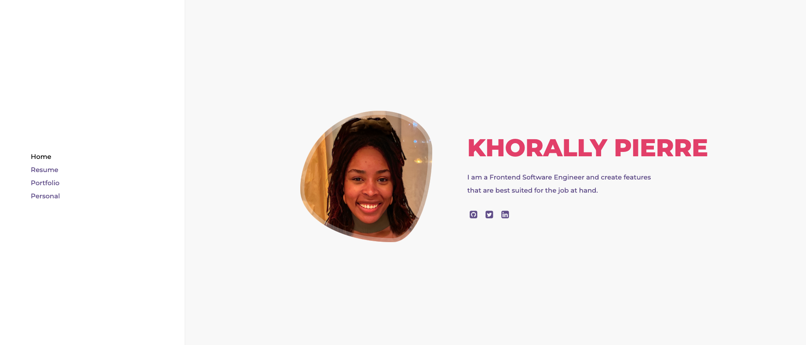
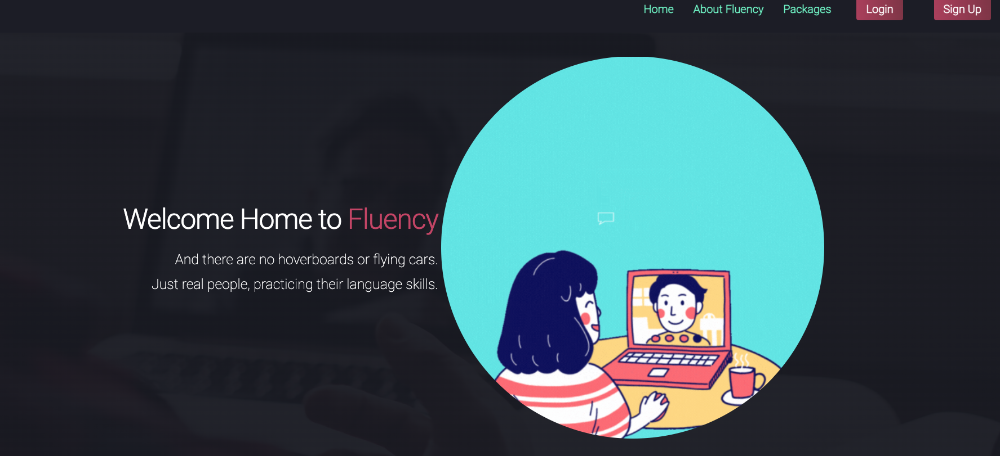
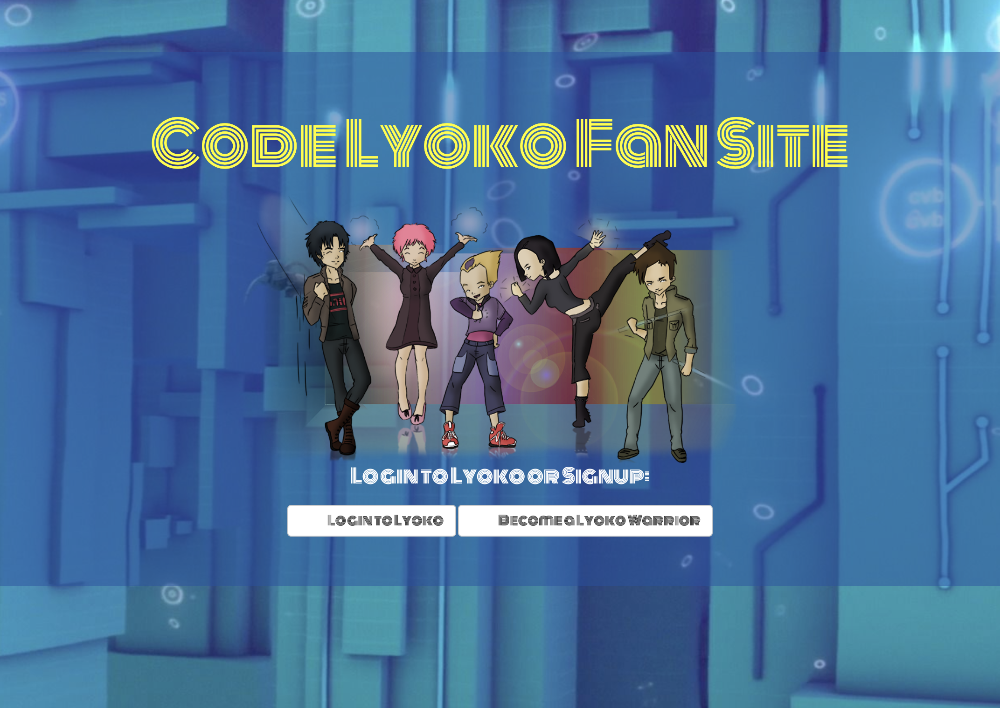
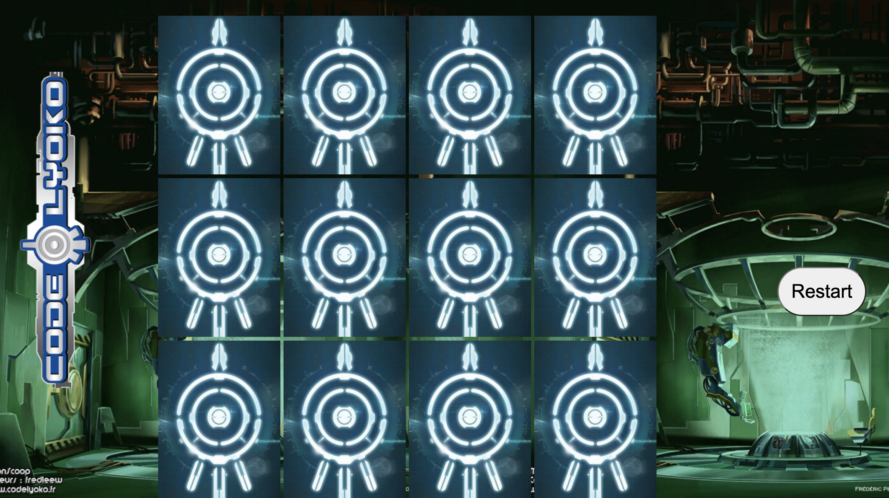

  
  
  

  

I am a Boston-based full-stack engineer; motivated by the power of technology as a tool for positive change; and with a background in legal and education.

See [my website](https://khorallypierre.com) for more information!

* * *

## Projects

<table bordercolor="#66b2b2">

<table>
  <tr>
  <td width="33%" valign="top">
    <h3> Portfolio</h3>
       
      
<a target="_blank" href="https://github.com/KhorallyPierre/Portfolio">Repo</a> // <a target="_blank" href="http://www.khorallypierre.org">Site</a>

       
      
      
<strong>HTML5, CSS3, Sass, Javascript</strong> - Portfolio Site including links to my projects and ways to get in contact with me.

  </td>

  <td width="33%" valign="top">
    <h3> To-Do List Express </h3>
       
      
<a target="_blank" href="https://github.com/KhorallyPierre/Khorallys-ToDo-List-Express">Repo</a> // <a target="_blank" href="https://khorallypexpress.herokuapp.com/">Site</a>

       
      
        
<strong>Javascript, Bootstrap, Sass, Node.js, & Express.js</strong> - Platform to help keep track of your daily to-dos, along with a feature to clear your list when you're done.

  </td>
  </tr>
</table>

<table>
  <tr>
    <td width="33%" valign="top">
      <h3> "Code Lyoko Fan Site!"</h3>
         
        
<a target="_blank" href="https://github.com/KhorallyPierre/Code-Lyoko-Login">Repo</a> // <a target="_blank" href="https://fast-chamber-70856.herokuapp.com/">Site</a>

         
        
        
<strong>Javascript & Phaser.js</strong> - The awaited Code Lyoko fan page! Upload your favorite Lyoko warrior, and unlock your very first mission when you log in! 

    </td>
    <td width="33%" valign="top">
      <h3> Code Lyoko Matching Cards</h3>
         
        
<a target="_blank" href="https://github.com/KhorallyPierre/matching-card-code-lyoko/tree/answer">Repo</a> // <a target="_blank" href="https://wonderful-easley-4bdc4b.netlify.app/">Site</a>

         
        
        
<strong>HTML5, CSS3, & Javascript</strong> - With over 10 different cards, test your memory in this code lyoko themes matching card game.

    </td>
  </tr>
</table>

## Skills

<table>
  <tr>
    <td>
      
    </td>
    <td>
        
        
        
        
    </td>
    <td>
        
        
        
        
        
    </td>
    <td>
        
        
        
        
    </td>
  </tr>
</table>
